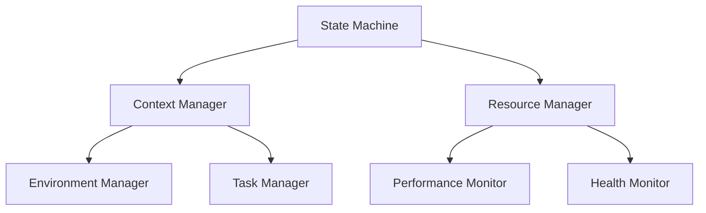
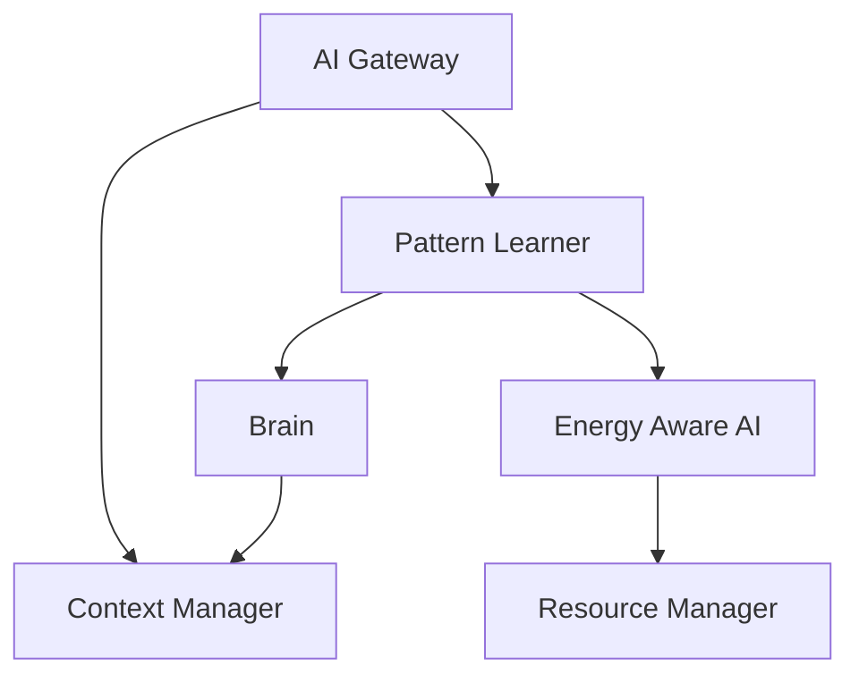
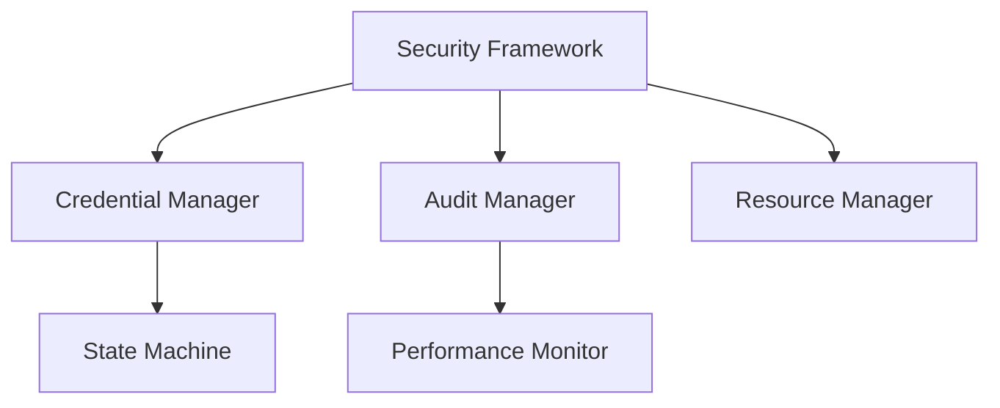
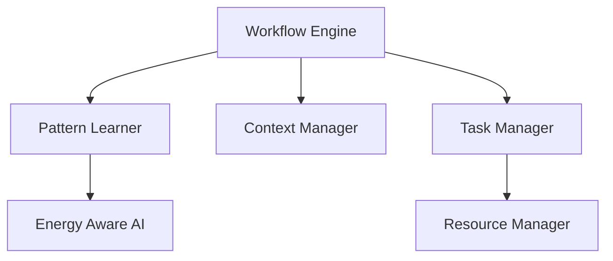
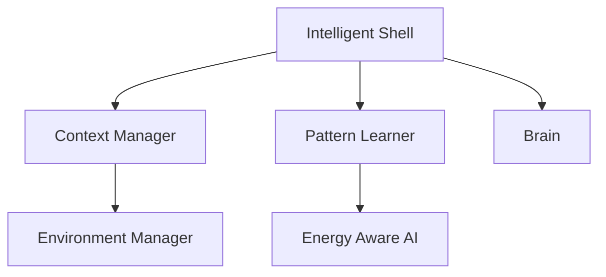

# System Dependencies and Interconnections

## Core System Dependencies

### State Management Layer



### AI Integration Layer



### Security Layer



## Feature Dependencies

### Workflow System



### Shell Integration



## Data Flow Patterns

### Context Flow

```yaml
flows:
  context_propagation:
    source: Context Manager
    destinations:
      - State Machine
      - Task Manager
      - Resource Manager
    attributes:
      - State information
      - Resource requirements
      - Priority levels

  pattern_flow:
    source: Pattern Learner
    destinations:
      - Brain
      - Energy Aware AI
      - Context Manager
    attributes:
      - Usage patterns
      - Resource patterns
      - Behavior patterns
```

### Resource Flow

```yaml
flows:
  resource_allocation:
    source: Resource Manager
    destinations:
      - Task Manager
      - Performance Monitor
      - Health Monitor
    attributes:
      - Resource limits
      - Usage metrics
      - Health status

  energy_flow:
    source: Energy Aware AI
    destinations:
      - Resource Manager
      - Task Manager
      - Context Manager
    attributes:
      - Energy levels
      - Optimization hints
      - Priority adjustments
```

## Integration Points

### External Systems

```yaml
integration_points:
  llm_providers:
    - Ollama:
        endpoint: "localhost:11434"
        components:
          - AI Gateway
          - Pattern Learner
          - Context Manager

    - LM Studio:
        endpoint: "localhost:1234"
        components:
          - AI Gateway
          - Brain
          - Pattern Learner

    - Jan:
        endpoint: "localhost:1337"
        components:
          - AI Gateway
          - Context Manager
          - Energy Aware AI
```

### Internal Systems

```yaml
integration_points:
  core_systems:
    state_management:
      provides:
        - State tracking
        - Context handling
        - Resource allocation
      consumes:
        - Pattern data
        - Energy metrics
        - Health status

    ai_integration:
      provides:
        - Pattern recognition
        - Energy awareness
        - Context optimization
      consumes:
        - State information
        - Resource metrics
        - Usage patterns
```

## Resource Dependencies

### Computation Resources

```yaml
resources:
  cpu:
    heavy_users:
      - Pattern Learner
      - AI Gateway
      - Brain
    optimization:
      - Async processing
      - Task scheduling
      - Resource pooling

  memory:
    heavy_users:
      - Context Manager
      - State Machine
      - Pattern Learner
    optimization:
      - Cache management
      - Resource limits
      - Memory pooling
```

### Storage Resources

```yaml
resources:
  persistent:
    heavy_users:
      - State Machine
      - Pattern Learner
      - Audit Manager
    optimization:
      - Data compression
      - Cache strategy
      - Cleanup policies

  temporary:
    heavy_users:
      - Context Manager
      - Task Manager
      - AI Gateway
    optimization:
      - Size limits
      - TTL policies
      - Cleanup triggers
```

## Optimization Opportunities

### Resource Optimization

```yaml
optimizations:
  computation:
    strategies:
      - Async processing
      - Task batching
      - Priority scheduling
    components:
      - Pattern Learner
      - AI Gateway
      - Brain

  memory:
    strategies:
      - Cache optimization
      - Resource pooling
      - Memory limits
    components:
      - Context Manager
      - State Machine
      - Task Manager
```

### Performance Optimization

```yaml
optimizations:
  response_time:
    strategies:
      - Request caching
      - Predictive loading
      - Resource reservation
    components:
      - AI Gateway
      - Context Manager
      - Task Manager

  throughput:
    strategies:
      - Parallel processing
      - Queue optimization
      - Load balancing
    components:
      - Pattern Learner
      - Resource Manager
      - Task Manager
```

## Critical Paths

### Core Operations

```yaml
paths:
  command_processing:
    sequence:
      1: Intelligent Shell
      2: Context Manager
      3: Pattern Learner
      4: Task Manager
    optimization:
      - Response caching
      - Pattern prediction
      - Resource reservation

  state_transition:
    sequence:
      1: State Machine
      2: Context Manager
      3: Resource Manager
      4: Task Manager
    optimization:
      - State caching
      - Predictive allocation
      - Priority handling
```

### AI Operations

```yaml
paths:
  llm_processing:
    sequence:
      1: AI Gateway
      2: Pattern Learner
      3: Brain
      4: Context Manager
    optimization:
      - Response caching
      - Provider selection
      - Context preparation

  pattern_learning:
    sequence:
      1: Pattern Learner
      2: Brain
      3: Energy Aware AI
      4: Resource Manager
    optimization:
      - Batch processing
      - Resource optimization
      - Priority scheduling
```
